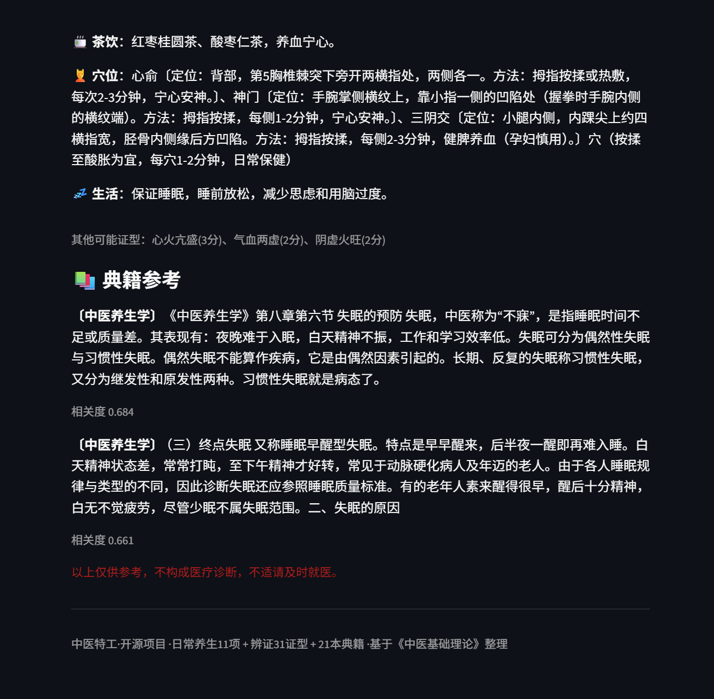
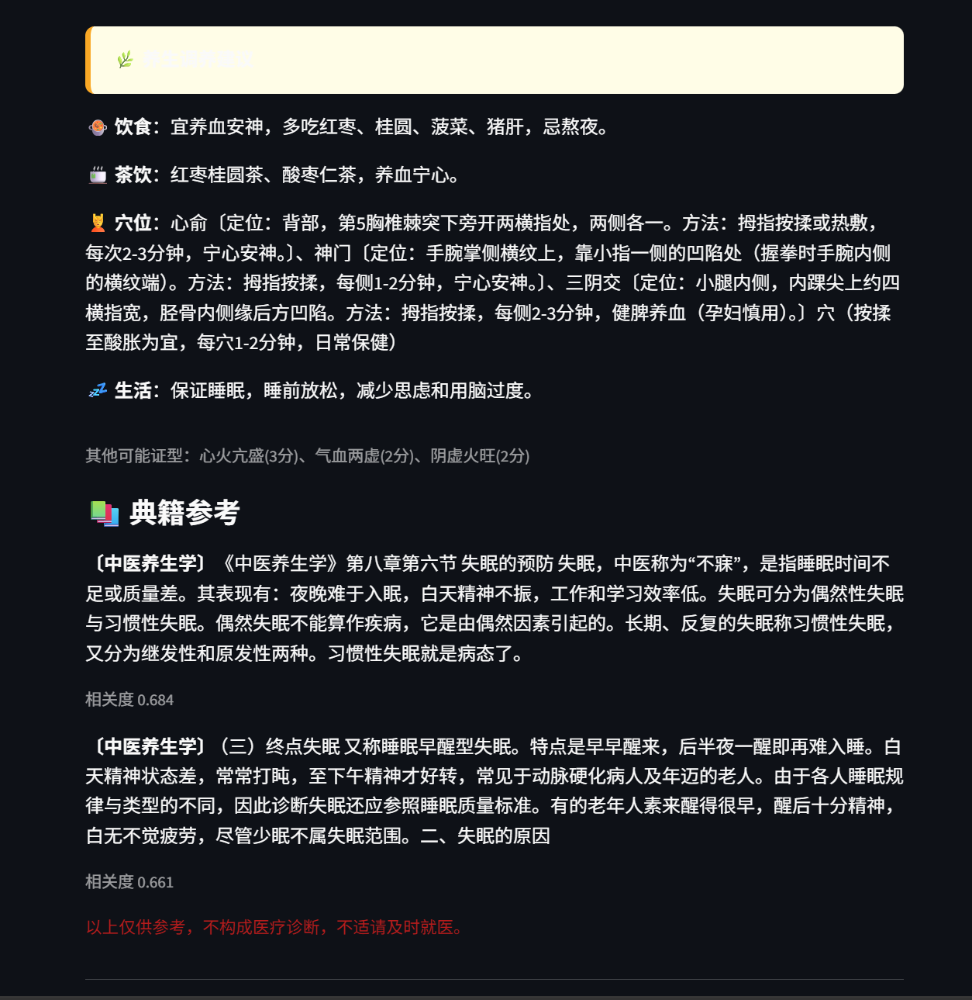
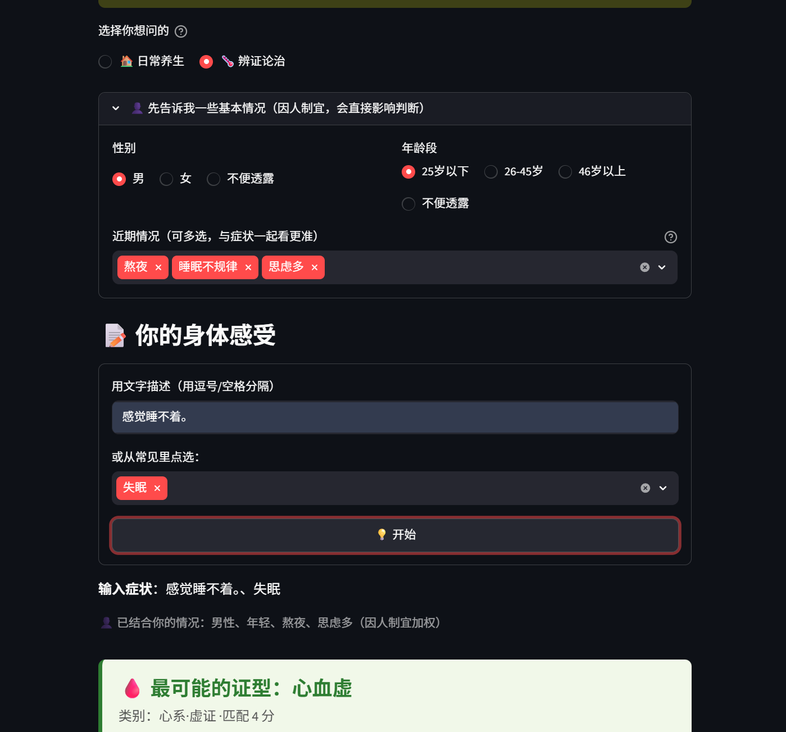

# 🌿 TCM Agent — 中医药辨证调养助手

[](https://github.com/leropeter/tcm-agent/actions/workflows/ci.yml)

> 输入你的身体感受（症状），基于中医辨证理论给出**可能的证型** + **调养建议**（饮食/茶饮/穴位/生活作息）+ 配图。
> 开源项目，MIT 许可证，可自由下载使用。

**⚠️ 重要声明**：本项目仅用于**中医知识学习与养生参考**，不构成医疗诊断，**不替代专业医师诊疗**。身体不适请及时就医。

---

## ✨ 核心功能

- ✅ **症状 → 中医辨证**：基于八纲辨证（阴阳·表里·寒热·虚实）+ 脏腑辨证，输出可能的证型（如"肝郁气滞""脾气虚"）
- ✅ **🏠 日常养生模式**：输入"有点失眠/舌边有齿痕/手脚冰凉"等日常困扰 → 生活化调理建议（作息/饮食/茶饮/穴位/情绪）
- ✅ **34 个常见证型**：覆盖外感、肺系、心系、肝系、脾系、肾系、气血津液、妇科、儿科
- ✅ **📚 典籍参考（RAG）**：检索 21 本中医经典（《本草纲目》《黄帝内经》《伤寒论》《中医养生学》等）的相关原文，作为建议出处
- ✅ **调养建议生成**：针对证型给出饮食、茶饮、穴位、生活作息建议
- ✅ **Web 界面**：浏览器打开就能用，无需命令行
- ✅ **🧬 体质识别**：基于王琦九种体质学说（平和/气虚/阳虚/阴虚/痰湿/湿热/血瘀/气郁/特禀），根据症状识别体质倾向，因人制宜给针对性建议
- ✅ **可解释**：每个结论都标注辨证依据与命中症状，不是黑盒
- ✅ **离线可用**：纯规则引擎 + 轻量词频检索，零第三方依赖，下载即用

### 📸 效果展示

<p align="center">
  
  
  
</p>

> 真实运行界面截图

---

## 🚀 快速开始

### 环境准备
- Python 3.10+（本机：`L:\Python312\python.exe`）

### 安装
```bash
git clone https://github.com/leropeter/tcm-agent.git
cd tcm-agent
pip install -r requirements.txt
```

### 方式一：Web 界面（推荐）
```bash
pip install streamlit
streamlit run app.py
```
浏览器自动打开 → 输入症状 → 点"开始辨证"。

### 方式二：命令行
```bash
python examples/demo.py --symptom "头痛 怕冷 流清涕"
```

### 运行测试
```bash
python tests/test_knowledge.py
```

### 基本使用（命令行输出示例）
```
🌡️  可能证型：风寒束表（风寒感冒）
📋  辨证依据：恶寒 + 无汗 + 流清涕 + 舌淡苔薄白
🍵  建议茶饮：生姜红糖水
💆  穴位调理：风池穴、大椎穴
💤  生活建议：注意保暖，避风寒，喝热水
```

## 📁 项目结构
```
tcm-agent/
├── app.py              # 🌐 Web 界面（Streamlit）
├── README.md
├── LICENSE             # MIT
├── .gitignore
├── requirements.txt
├── src/
│   ├── agent.py        # 辨证主逻辑（症状→证型→调养）
│   ├── knowledge.py    # 中医知识库（31 证型，症状-证型-调养规则表）
│   └── rag.py          # 📚 典籍检索（21 本经典切块+词频检索）
├── tests/
│   ├── test_knowledge.py  # 知识库自检
│   └── test_rag.py        # 典籍检索自检
├── data/
│   ├── books/          # 21 本中医经典（Markdown）
│   └── sample/         # 示例数据
├── examples/
│   └── demo.py         # 命令行演示
├── docs/
└── assets/             # 配图（后续放真实穴位/药材图）
```

## 🧠 技术架构
- **辨证引擎**：纯 Python 规则 + 加权知识库（可解释、可扩展、离线）+ 因人制宜问诊线索
- **典籍参考（RAG）**：关键词检索（默认，零依赖）+ **可选语义检索**（sentence-transformers 向量化，`python scripts/build_vector_index.py` 预构建后启用，未预构建自动降级）
- **Web 界面**：Streamlit
- **自动测试**：GitHub Actions CI（`python run_tests.py`）
- **未来增强**：可选 LLM 润色（DeepSeek API）

## 🤝 贡献指南
欢迎提交 Issue 和 Pull Request！尤其是补充更多"症状→证型"知识条目。

## 📄 许可证
[MIT License](./LICENSE)

## 📮 反馈
通过 GitHub Issue 反馈问题或建议。
